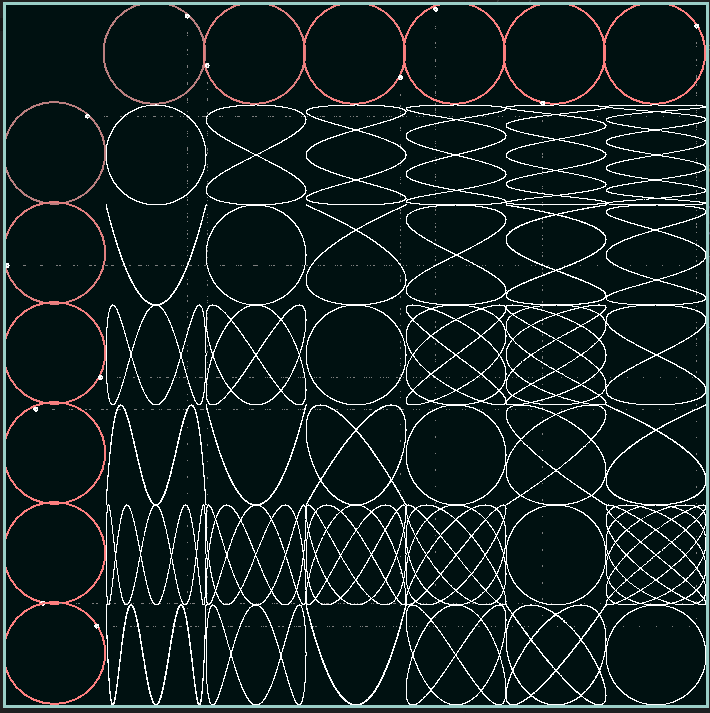

# wave-table

A table of circle oscillations, if you will.

## Dependencies

* C++17
* SFML

## Building

```bash
git clone https://github.com/sarahkittyy/wave-table.git
cd wave-table
mkdir build
cd build
cmake ..
make
```

## Running

```bash
# pwd = .../wave-table
./build/wave-table
```

## Screenshot

